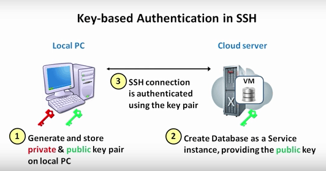

# ¿Qué es el servidor SSH?
El servidor SSH facilita el establecimiento de conexiones remotas que permiten la transmisión segura de cualquier tipo de dato. Un ejemplo de servidor SSH es OpenSSH, que es la implementación libre más usada. Sus características son:
1. Código abierto
2. Licencia libre
3. Compatible con SSH1 y SSH2
4. Disponible para muchas plataformas
5. Reenvío por puertos y agentes
6. Soporta cliente y servidor SFTP en SSH1 y SSH2
7. Comprime los datos

El funcionamiento del servidor SSH se configura a través de los distintos archivos de configuración, tales como:
* sshd_config: Describe la configuración del servidor. Permite configurar opciones como el puerto de escucha, la versión del protocolo, dónde se encuentra la clave privada o si ha sido generada por RSA o DSA entre otras

* ssh_config: Describe la configuración del cliente SSH

* ssh_hot_rsa_key: Clave RSA privada
* ssh_hot_rsa_key.pub: Clave RSA pública
* known__hosts: Claves públicas de otras máquinas
* ssh_host_dsa_key: Clave DSA privada de la máquina
* ssh_host_dsa_key.pub: Clave DSA pública de la máquina

# Autenticación
Existen varios métodos de autenticación

# Autenticación por contraseña
Cada vez que el usuario quiera establecer una conexión con el servidor, se le requerirá la contraseña, el servidor la comprobará y si es correcta permitirá la conexión.  Éstp se basa en el archivo /etc/shadow

# Autenticación por clave pública
Se copia una clave pública a todos los servidores que el cliente quiere conectarse. El cliente posse una clave privada cifrada.
La información cifrada con clave pública sólo puede descifrarse con la correspondiente clave privada. Su funcionamiento es el siguiente:
1. Se establece la conexión y el servidor genera un númeor aleatorio cifrado con clave pública mediante RSA o DSA y se envía al usuario.
2. El cliente debe descrifrarlo con la clave privada y devovler una respuesta, también cifrada, al servidor.
3. El servidor descifra la respuesta con la clave pública
4. Si coinciden la respuesta con la información que envió, confirma la autenticación