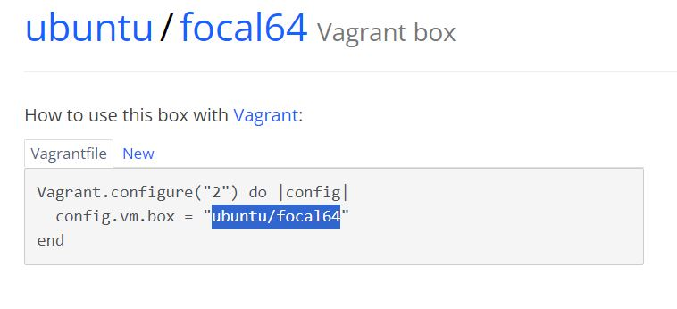

# Instalación de Vagrant
El primer paso para trabajar con vagrant es instalarlo, para ello usamos 
```bash
apt update
apt install vagrant
```

# Creación del VagrantFile
El Vagrantfile es el fichero que nos sirve para definiar la máquina virtual que vamos a crear. Para crear este fichero necesitamos un sistema operativo, esto lo podemos obtener de [Repositorio de vagrant](https://app.vagrantup.com/boxes/search)


Una vez escogemos un sistema operativo, copiamos su id


A continuación abrimos Visual Studio code en el directorio donde queremos crear la máquina virtual y allí en la terminal, escribimos:
```bash
vagrant init id_contenedor
```
Entonces se creará el vagrantfile, el cual podremos modificar según necesitemos. Una vez tenemos el vagranfile, usamos ```bash vagrant up ``` para arrancar la máquina virtual.
Para contectarnos a ella y poder trabajar usaremos
```bash
vagrant ssh
```
Entonces el prompt del sistema debe cambiar al de la máquina virtual


# Eliminar máquina virtual
Para eliminar una máquina virtual de vagrant lo primero que debemos hacer es detenerla, para ello es necesario usar el comando:
```bash
vagrant halt
```
A continuación, en el directorio donde se encuentra el vagrantfile usamos:
```bash
vagrant destroy
```
Con esto la máquina virtual ya habría sido eliminada

# Exportar una máquina virtual
Para exportar una máquina virtual a vagranbox es necesario crear el archivo '.box'. Esto se hace en el directorio donde está el vagrantfile
```bash
vagrant package ---output nombre.box
```
Una vez tenemos el archivo .box nos registramos en la web de vagrant y a través de la web, subimos el archivo, que será público.