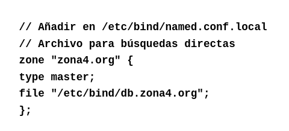
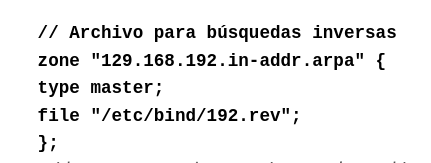
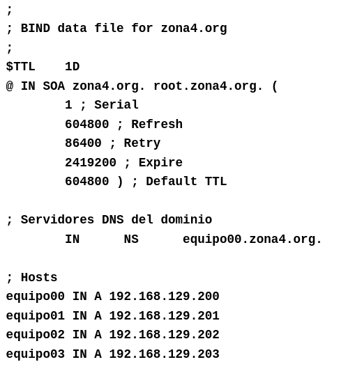
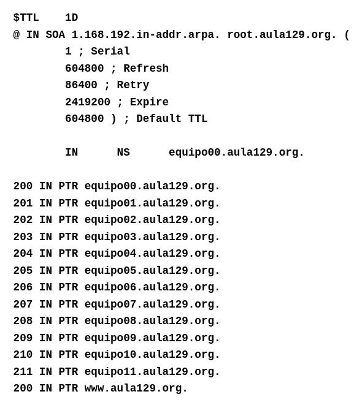

# Servidor DNS maestro 

El servidor maestro DNS hace las funciones de resolución de direcciones, de forma que cuando un servidor caché le lanza una consulta, este la resuelve y le devuelve el nombre de dominio correspondiente a la dirección IP que recibió. 

## 1. Configuración de un DNS maestro
Para configurar un servidor DNS maestro debemos indicarlo en el archivo `/etc/bind/named.conf.local` añadiendo el tipo `master` como se indica en la imagen siguiente.

Además también debemos configurar el archivo para las búsquedas inversas

A continuación, es necesario crear los archivos `db.zona4.org` y `192.rev` e indicar en ellos los equipos y direcciones de la red local. En la siguiente imagen se muestra un ejemplo de cómo se desarrolla el archivo db.zona4.org.

La imagen se puede dividir en tres bloques, el primero son los parámetros relacionados con el funcionamiento de DNS en cuanto actualización, periodos de reintento y versión, en el segundo bloque se declara el servidor maestro, que sería `equipo00` y en el último bloque se declaran el resto de equipos de la red local.

El último paso es crear el archivo de búsqueda inversa, el cual se encargará de hacer consultas de IP a nombre, para esto creamos el archivo `192.rev` como mencionamos anteriormente.

El archivo de búsqueda inversas tiene los mismos blosques que el archivo de búsqueda directa, cambiando sólo la forma en la que se declara la zona en el primer bloque y los equipos en el tercero. En este caso el último triplete de la dirección IP de cada equipo es el que los identifica dentro de la red.

