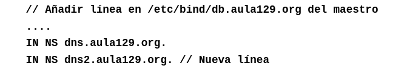
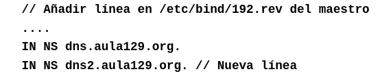
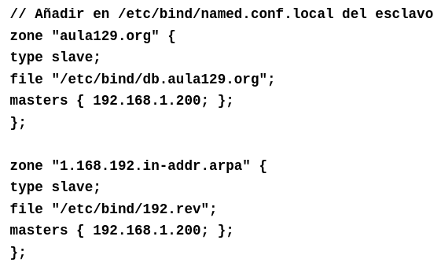
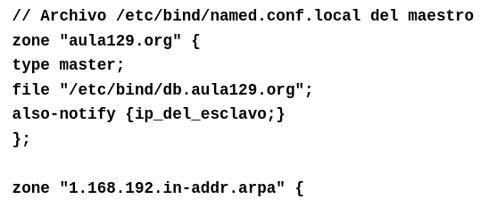

# Servidor DNS maestro 
Un servidor DNS esclavo es aquel que para resolver las consultas de direcciones debe hacer las peticiones a un servidor maestro ya que por sí mismo no contiene ningún registro. Su función principal es reducir la carga del servidor maestro.

## 1. Configuración de un DNS esclavo
Para configurar un DNS esclavo lo único que debemos hacer es indicar quién es el servidor maestro de su zona y en el archivo de configuración del maestro añadir al esclavo.

En resumen, debemos tocar tres archivos diferentes, dos en el maestro y una en el esclavo.

## En el maestro modificaremos los archivos

### `/etc/bind/db.aula129.org`
Añadiendo el nuevo servidor esclavo

### `/etc/bind/192.rev`

## En el esclavo modificaremos el archivo
### `/etc/bind/named.conf.local`
Aquí en `type` indicamos que es esclavo y además añadimos a qué maestro debe hacer las peticiones

De forma optativa, en el servidor maestro podemos añadir la línea `also-notify` para que se mantenga sincronizado de forma que cuando haya un cambio de zona, pase del maestro al esclavo

