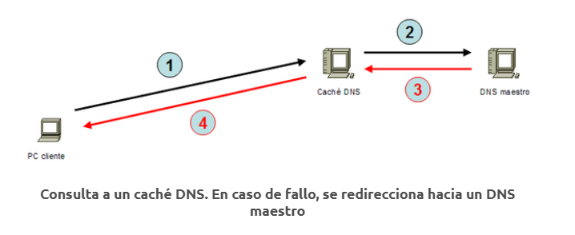

# Introducción a BIND9

BIND9 (Berkeley Internet Name Domain) es el servidor de nombres de dominio (DNS) más utilizado en Internet. Proporciona servicios de DNS para traducir nombres de dominio legibles por humanos en direcciones IP numéricas y viceversa. Aquí hay una explicación de qué es BIND9 y cómo instalarlo y ponerlo en marcha:

## ¿Qué es BIND9?

BIND9 es un software de servidor de nombres de dominio de código abierto y ampliamente utilizado. Es mantenido por Internet Systems Consortium (ISC) y está disponible de forma gratuita bajo la Licencia Pública General de GNU (GPL). BIND9 se utiliza para implementar servicios de DNS en una variedad de sistemas operativos, incluidos Linux, Unix y Windows.


## Instalación de BIND9

### En sistemas basados en Ubuntu

Para instalar BIND9 en sistemas basados en Ubuntu, puedes ejecutar el siguiente comando en la terminal:

```
sudo apt update
sudo apt install bind9
```


## Configuración básica de BIND9

Una vez que BIND9 está instalado, puedes comenzar a configurarlo para que funcione como un servidor DNS. Aquí hay algunos pasos básicos para configurar BIND9:

- **Archivo de configuración principal**: El archivo de configuración principal de BIND9 se encuentra típicamente en `/etc/bind/named.conf`. Aquí es donde se definen las zonas DNS y se especifican los archivos de datos de cada zona.

- **Zonas DNS**: Una zona DNS representa un dominio específico y contiene registros que asignan nombres de dominio a direcciones IP y viceversa. Puedes crear zonas DNS para tus dominios y subdominios en el archivo de configuración principal.

- **Archivos de datos de zona**: Los archivos de datos de zona contienen los registros DNS para cada zona. Estos archivos especifican las relaciones entre nombres de dominio y direcciones IP, así como otros tipos de registros como MX (Mail Exchange) o CNAME (Canonical Name).

- **Reiniciar el servicio BIND9**: Después de realizar cambios en la configuración de BIND9, es importante reiniciar el servicio para que los cambios surtan efecto. Puedes reiniciar BIND9 utilizando el siguiente comando en la terminal:

```
sudo systemctl restart bind9
```

Una vez configurado y en funcionamiento, BIND9 proporcionará servicios de DNS para traducir nombres de dominio en direcciones IP y viceversa, lo que permitirá la navegación en Internet y la comunicación entre sistemas de manera eficiente y confiable.


Algunos enlaces de interes sobre bind9

* [Domain Name Service (DNS)](https://ubuntu.com/server/docs/service-domain-name-service-dns?authuser=0)
* [Install and Configure Dnsmasq on Ubuntu](https://www.evernote.com/shard/s201/u/0/client/snv?isnewsnv=true&noteGuid=08d9c05e-97ec-4138-aed4-84c6374d874a&noteKey=3351b8b9a7ea7acbab5add76080f3902&sn=https%3A%2F%2Fwww.evernote.com%2Fshard%2Fs201%2Fsh%2F08d9c05e-97ec-4138-aed4-84c6374d874a%2F3351b8b9a7ea7acbab5add76080f3902&title=Install%2Band%2BConfigure%2BDnsmasq%2Bon%2BUbuntu%2B20.04%257C18.04%2B%257C%2BComputingForGeeks&authuser=0)
* [Servidor DNS sencillo con dnsmasq](https://docs.google.com/document/d/1GPwmdbTWoF-Ed9CCHqSsaAHKK_vj77kjRZc7dCEm4Bg/edit#heading=h.i80pytvzdhd8)
